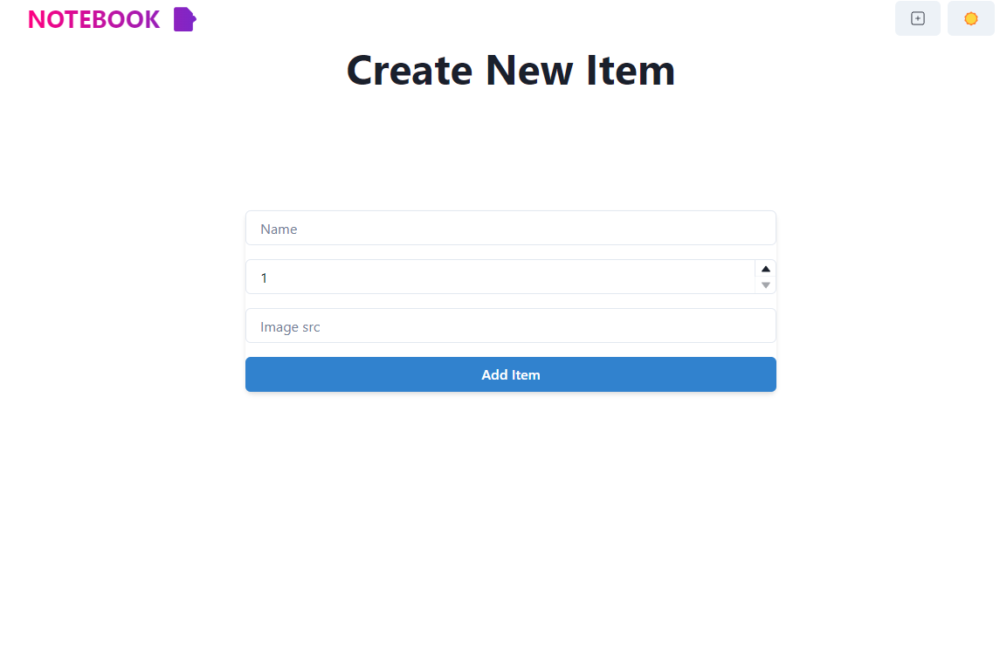

<h1> This is a project to Learn about the MERN Stack </h1>
<ul>
<li><h4> Note : .env must be configured in the root directory with MONGO_URI and PORT eg MONGO_URI= mongodb+srv://{username>}:{password}@.... PORT=9999</h4></li>
<li><h4> Moreover the Port and URL is also defined in frontend/store and backend/server.js and in case of change in port number or host </h4></li>
<ul>

<h2>Images :</h2>
<<<<<<< HEAD

=======

>>>>>>> ea7d7883c21e695cda5866b0e7d2b09ebfe1bfb0
